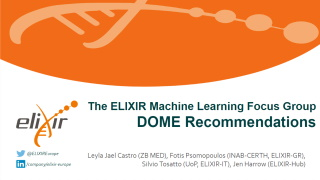
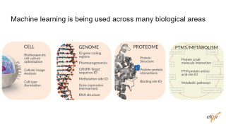
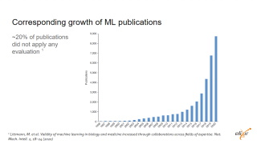
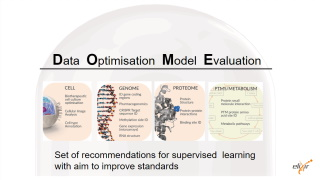
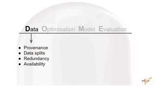
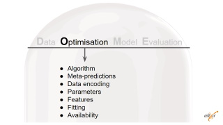
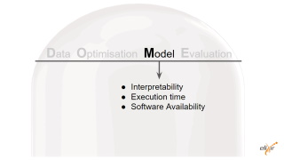
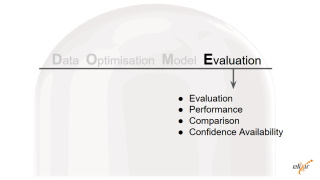

# DOME recommendations
_Duration 15 minutes_

    <iframe src="https://docs.google.com/presentation/d/e/2PACX-1vRW8IKxKYpzOvd7nMmd8Dg2pqfiHetypXAbVc_Rt_o2gZyBWfuqKzDlndOpYUJ3A3OaLb0UZ5TamlS8/embed?start=false&loop=true&delayms=3000" frameborder="0" width="960" height="569" allowfullscreen="true" mozallowfullscreen="true" webkitallowfullscreen="true"></iframe>

## Slides content

<table>
  <tr>
    <td></td>
    <td colspan="2">
      ELIXIR ML Focus Group  
      More information on the <a href="https://elixir-europe.org/focus-groups/machine-learning" target="_blank">web page</a> 
      Currently co-chaired by Fotis Psomopoulos, Silvio Tossato, Leyla Jael Castro
    </td>
  </tr>
  <tr>
    <td>
      
    
    </td>
    <td>
      Why do we need standards to publish machine learning approaches?  
      Machine/Deep learning has a high impact in biomedical research, it touches all areas.  
      We have more and more publications but there is no agreement on what key elements could be use to describe a machine learning approach  
      For instance, about 20% of publications including a machine learning approach do not include information about the evaluation
    </td>
  </tr>
  <tr>
    <td></td>
    <td>
      The DOME recommendations propose some of those key elements for machine learning approaches  
      They include Data, Optimization, Model and Evaluation  
      By now, they focus on supervised learning only
    </td>
  </tr>
    <tr>
    <td></td>
    <td><ul>
       <li>Provenance: Protein Data Bank (PDB). X-ray structures missing residues. Npos = 339,603 residues. Nneg = 6,168,717 residues. Previously used in (Walsh et al., Bioinformatics 2015) as an independent benchmark set. </li>
       <li>Dataset splits: training set: N/A. Npos,test = 339,603 residues. Nneg,test = 6,168,717 residues. No validation set. 5.22% positives on the test set. </li>
       <li>Redundancy between data splits: Not applicable. Availability of data Yes, URL: http://protein.bio.unipd.it/mobidblite/. Free use license.</li>
    </ul></td>
  </tr>
    <tr>
    <td></td>
    <td><ul>
      <li>Algorithm: Majority-based consensus classification based on 8 primary ML methods and post-processing. </li>
      <li>Meta-predictions: Yes, predictor output is a binary prediction computed from the consensus of other methods; Independence of training sets of other methods with test set of meta-predictor was not tested since datasets from other methods were not available. </li>
      <li>Data encoding: Label-wise average of 8 binary predictions. </li>
      <li>Parameters: p = 3 (Consensus score threshold, expansion-erosion window, length threshold). No optimization. </li>
      <li>Features: Not applicable. </li>
      <li>Fitting: Single input ML methods are used with default parameters. Optimization is a simple majority. </li>
      <li>Regularization: No. </li>
      <li>Availability of  configuration: Not applicable. </li>
    </ul></td>
  </tr>
    <tr>
    <td></td>
    <td><ul>
      <li>Interpretability: Transparent, in so far as meta-prediction is concerned. Consensus and post processing over other methods predictions (which are mostly balck boxes). No attempt was made to make the meta-prediction a black box. </li>
      <li>Output: Classification, i.e. residues thought to be disordered. </li>
      <li>Execution time: ca. 1 second per representative on a desktop PC. </li>
      <li>Availability of software: Yes, URL: http://protein.bio.unipd.it/mobidblite/. Bespoke license free for academic use.</li>
    </ul></td>
  </tr>
    <tr>
    <td></td>
    <td><ul>
      <li>Evaluation method: Independent dataset</li>
      <li>Performance measures: Balanced Accuracy, Precision, Sensitivity, Specificity, F1, MCC.</li>
      <li>Comparison: DisEmbl-465, DisEmbl-HL, ESpritz Disprot, ESpritz NMR, ESpritz Xray, Globplot, IUPred long, IUPred short, VSL2b. Chosen methods are the methods from which the meta prediction is obtained.</li>
      <li>Confidence: Not calculated.</li>
      <li>Availability of evaluation: No.</li>
    </ul></td>
  </tr>
  <tr>
    <td></td>
    <td>
      You can find more information in the <a href="https://doi.org/10.1038/s41592-021-01205-4" target="_blank">published paper</a> and the <a href="https://dome-ml.org/" target="_blank">DOME website</a>
    </td>
  </tr>
  <tr>
    <td></td>
    <td>
      <ul>
        <li>DOME annotation on scholarly articles → so we learn how much is commonly reported about ML approaches</li>
        <li>DOME formalization as structured metadata → BioHackathon Europe 2022, <a href="https://github.com/elixir-europe/biohackathon-projects-2022/tree/main/17" target="_blank">project 17 “Metadata schemas for Linked Open Science”</a></li>
        <li>(Metadata) DOME for quality assessment and comparison</li>
        <li>(Metadata) Connecting metrics to the DOME recommendations → moving beyond the qualitative assessment</li>
        <li>(Metadata) Extending DOME beyond supervised approaches</li>
        <li>Adoption → researchers, publishers, repositories (e.g, <a href="https://www.nfdi4datascience.de/" target="blank">NFDI4DataScience portal</a>)</li>
      </ul>
    </td>
  </tr>
<table>

